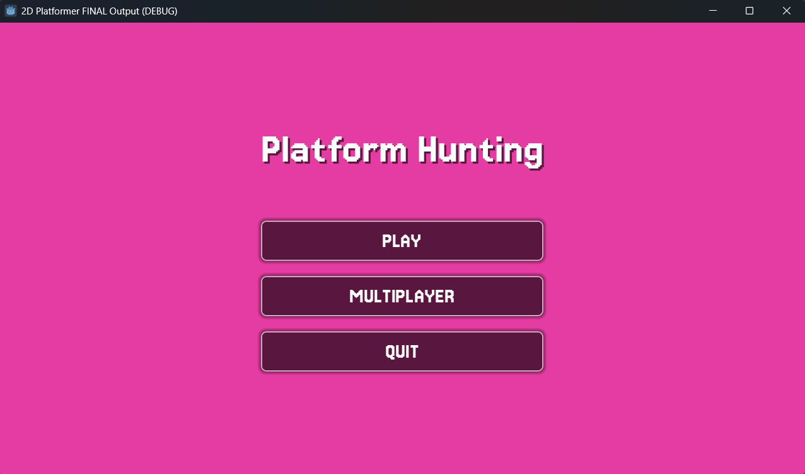
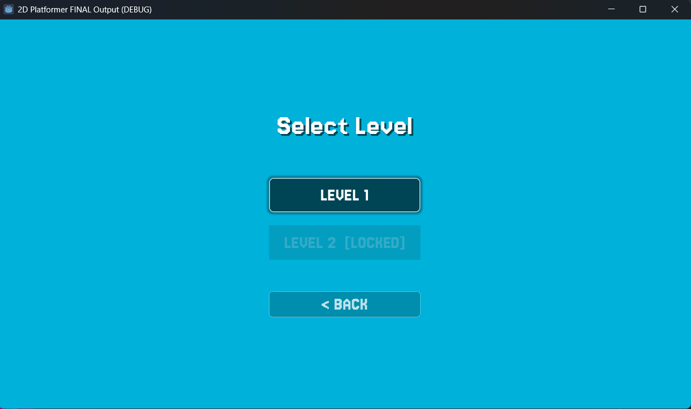
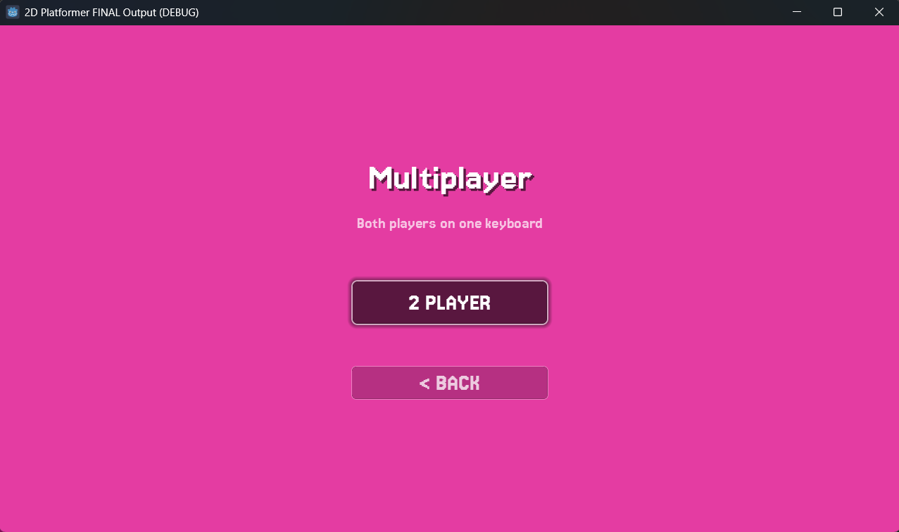
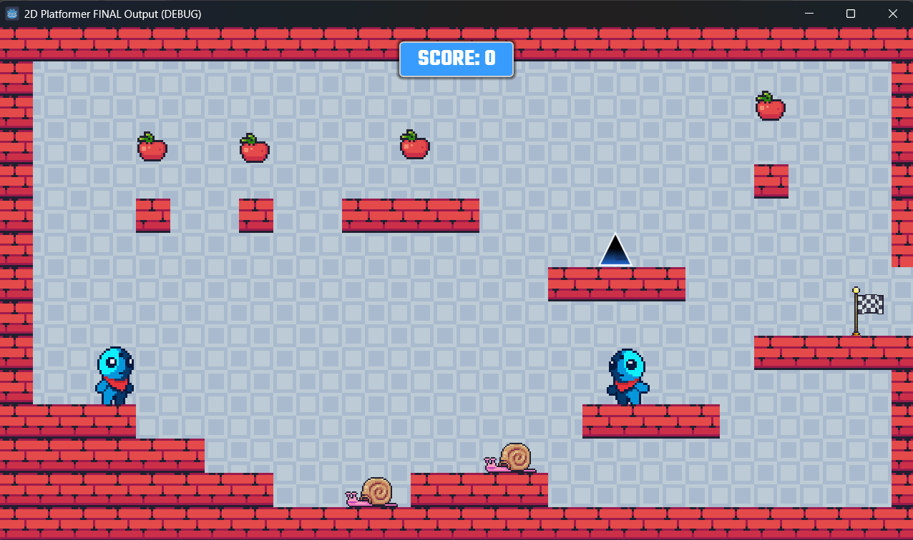
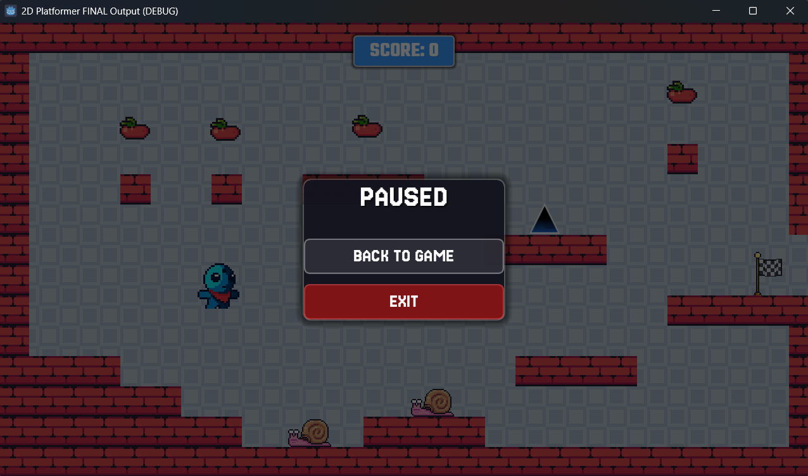
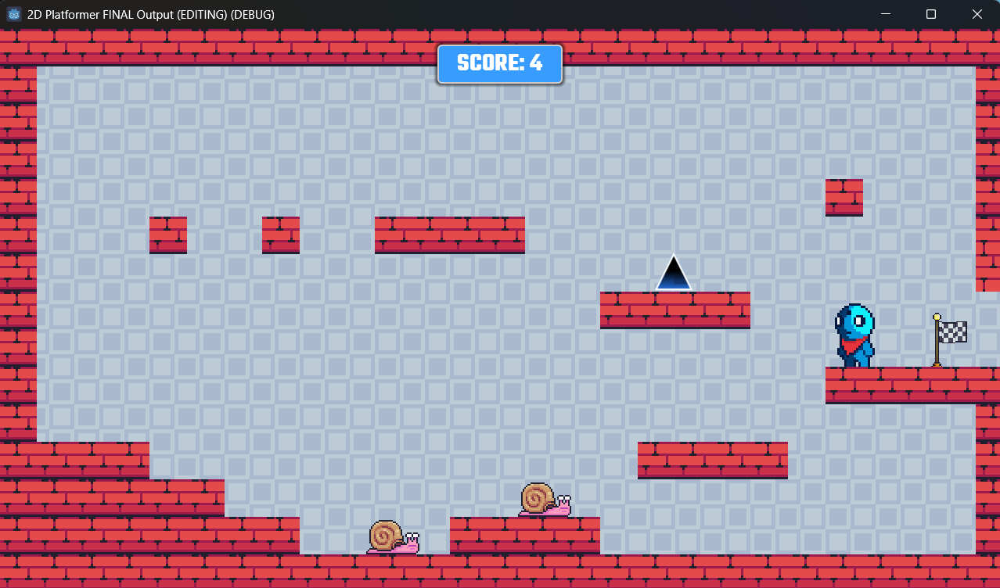
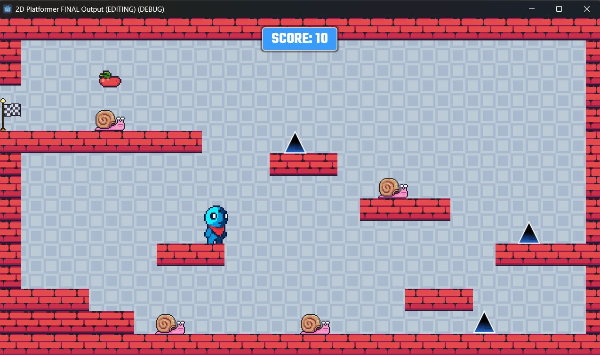
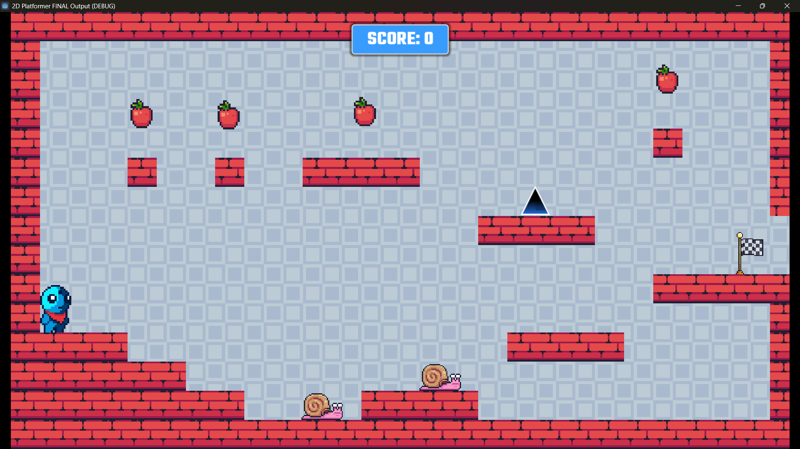
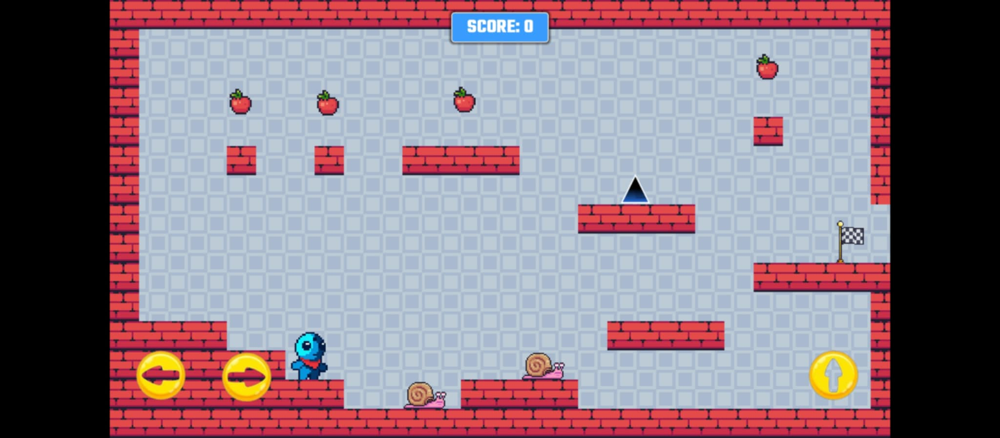

# Week 2

## Activity 2 Level Design
- Tilemaps for grid-based levels, adding hazards (spikes/traps), designing flow (pacing, difficulty curves).

Activity : Design of 2 levels for an endless runner (2D or 3D); Level 1 should be noticeable easier than level 2. Implement traps. No HP, once caught in trap restart from the beginning of the level. There should be a notification when entering level 2.

# Week 3 

## Activity 1 UI/UX Design \& Audio

- HUD elements (health bars, scores), menu systems (CanvasLayer), audio buses for mixing SFX/music.

Exercises:
- Integrate UI into your game proto; add sound effects, walk, run, slash, etc. You may also add game music, introduction, and so on.
*Added death sound and simple score system.

## Activity 2 AI \& Enemies

- Pathfinding navigation, finite state machines for behaviors (patrol/attack), enemy AI patterns.

Exercises:
- Add enemies to your game (note enemies, not obstacles)
*Added snail enemies that move back and forth.

# Week 4 

## Activity 2 Windows and Android Exports and Installations
- Export your game for both Windows and Android devices.
## Activity 3 Basic Multiplayer
- Add multiplayer support for your prototype.

# Gameplay Demo Screenshots

## Menu:

## Levels:

## Windows and Android demos respectively:

