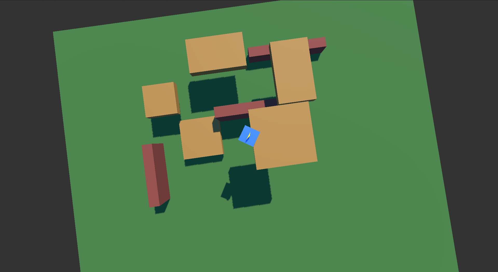
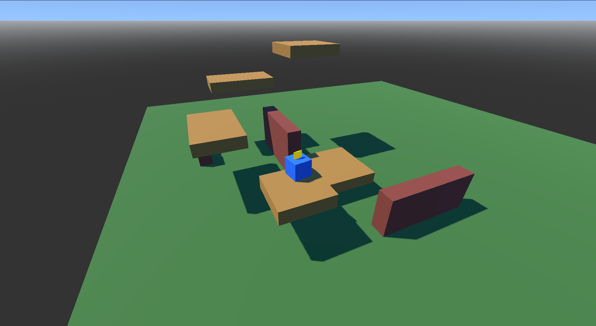

# Week 4 Activity 1: 3D Basics and Optimization

3D nodes (meshes, cameras), lighting (DirectionalLight), profiling tools
for FPS optimization.

Exercises:
Convert your 2D proto to 3D; optimize for 60 FPS.

New 3D platformer test using Claude AI for script writing and movement.

# Gameplay Demo Screenshots

The image shows the game's 3D platform and obstacle testing as well as some lighting test.

